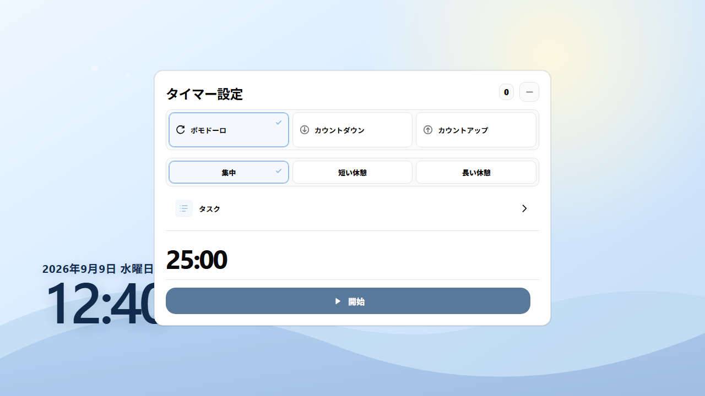
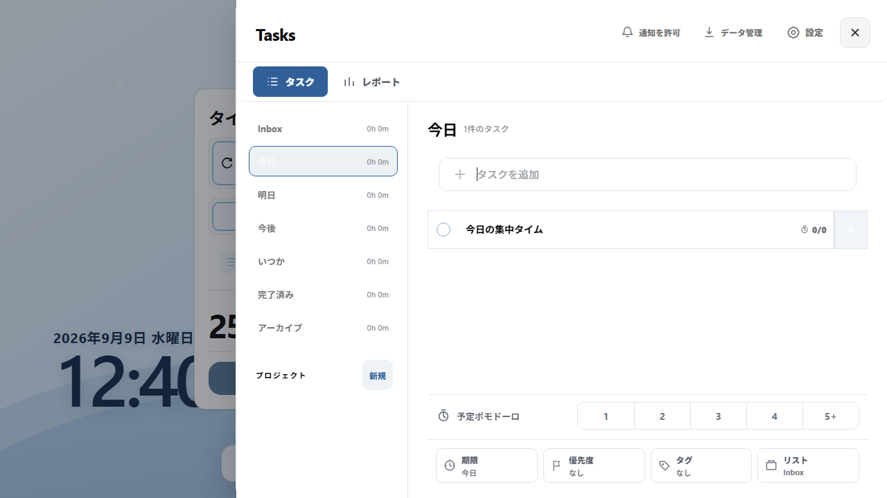
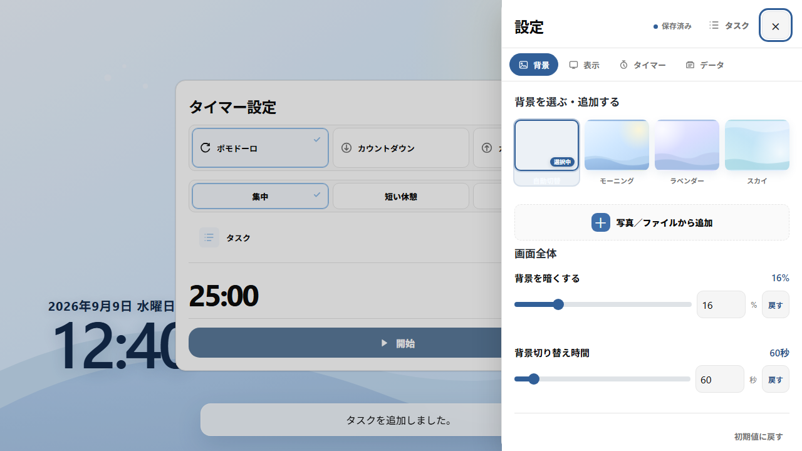

# FocusBoard

勉強や作業のあいだ、画面の片隅に置いておけるローカルファーストの時計・ポモドーロPWAです。

時刻を確認する。25分だけ集中する。終わったら、何に時間を使ったか振り返る。FocusBoardは、その流れをひとつの画面にまとめます。

アカウントもサーバーも必要ありません。設定、タイマー、タスク、集中記録、追加した背景画像は、使っている端末の中に保存されます。



## FocusBoardでできること

| 使い道 | できること |
| --- | --- |
| 時計 | 12時間／24時間表示、秒、サイズ、フォント、配置、日付形式を変更 |
| タイマー | ポモドーロ、カウントダウン、カウントアップ、休憩、フローティング表示 |
| タスク | 今日・明日・今後・いつか、プロジェクト、期限、優先度、タグ、メモ、サブタスク |
| 振り返り | 日・週・月の集中時間、プロジェクト別の比率、セッション履歴 |
| 背景 | 内蔵背景、自動切替、端末内の画像追加、位置・拡大縮小、色の自動調整 |
| 安心して使う | オフライン起動、JSONバックアップ、通知なしでも利用可能 |

## まずは1回、集中してみる

1. タイマー方式を選びます。迷ったら **ポモドーロ → 集中** のままで大丈夫です。
2. 必要なら **タスク** から取り組むタスクを選びます。タスクなしでも開始できます。
3. 時間を確認して **開始** を押します。
4. 終わったら、完了・休憩・延長を選びます。

タイマーは画面を閉じたり再読み込みしたりしても、保存された終了時刻を基準に進みます。開始後は円形のフローティングタイマーに縮めて、画面の好きな場所へ移動できます。

### タイマーの選び方

- **ポモドーロ**：集中、短い休憩、長い休憩を切り替えて使います。
- **カウントダウン**：決めた時間を一度だけ測ります。
- **カウントアップ**：経過時間を測ります。設定時間を1周の目安にして、時間を超えても止まりません。

## タスクを置いて、集中時間を残す

背景をタップすると現れるタスクボタン、またはタスク画面内の **タスク** から、タスク一覧を開けます。



タスク画面では、まず行き先を選び、上部の入力欄からすぐに追加できます。追加時に、予定ポモドーロ、期限、優先度、タグ、プロジェクトも指定できます。

- **今日／明日／今後／いつか** で、今やることを絞る
- タスク右端の開始ボタンから、すぐに集中タイマーを始める
- 詳細画面で、メモ、サブタスク、通知、繰り返しを整える
- **レポート** で、日・週・月、プロジェクト別、タスク別に集中時間を振り返る
- **データ管理** から、タスク・プロジェクト・集中履歴をJSONでバックアップ／復元する

期限切れのタスクは今日の一覧の最後にまとめて表示されます。繰り返しタスクは対象日に別の発生分として作成されるため、前日の未完了分を残したまま今日の分へ進めます。

## 背景と表示を自分の机に合わせる

設定は、スマートフォンでは下から、iPadやPCでは右側から開きます。設定画面は **背景／表示／タイマー／データ** の4つに分かれています。



### 背景

- 内蔵の「モーニング」「ラベンダー」「スカイ」などから選ぶ
- **自動切替** で背景をゆっくり切り替える
- 端末の写真や画像を最大8枚まで追加する
- 背景をドラッグ、ピンチ、ホイールで移動・拡大縮小する
- 時計・日付・タイマーの色を自動調整、または手動で指定する

### 表示

時計の12時間／24時間表示、秒の表示、サイズ、フォント、配置、日付形式を変更できます。時計をタップして、その場で表示設定を開くこともできます。

### タイマーとデータ

開始前の設定カードや円形タイマーの不透明度、色、配置を調整できます。設定のエクスポート、タイマー状態の削除、ローカルデータの初期化、PWAキャッシュの削除も **データ** から行えます。

## iPadのホーム画面に追加する

1. 公開URLをiPadのSafariで開きます。
2. 共有ボタンを押し、**ホーム画面に追加** を選びます。
3. 名前を確認して **追加** を押します。
4. ホーム画面のFocusBoardアイコンから起動します。

初回読み込み後は主要ファイルがキャッシュされ、オフラインでも起動できます。新しい版を受け取るときは、オンライン状態で一度起動してください。

## データとプライバシー

- ログイン、クラウド同期、外部サービス連携はありません。
- 設定とタイマーはブラウザのローカル保存領域に保存されます。
- タスク、プロジェクト、集中履歴は端末内データベースに保存されます。
- 追加した背景画像も端末内に保存され、外部へ送信されません。
- 通知を許可しなくても、時計・タイマー・タスクは利用できます。
- 大切なタスクデータは、削除や端末変更の前に **データ管理** からJSONへ書き出してください。

ブラウザの保存機能が使えない場合でも、時計とタイマーは起動できるように設計されています。ただし、その場合はタスク保存や設定保存が利用できないことがあります。

## 開発者向け

### 必要なもの

- Node.js 20以降
- npm

### 開発サーバーを起動する

```bash
npm install
npm run dev
```

Viteが表示したURLをブラウザで開きます。同一ネットワークのiPadから確認するときは、次を使います。

```bash
npm run dev -- --host
```

### テストとビルド

```bash
npm test
npm run typecheck
npm run lint
npm run build
npm run preview
```

成果物は `dist` に生成されます。通常のビルドは相対パスを使うため、サブディレクトリにも配置できます。公開先に合わせてパスを指定する場合は、Windows PowerShellで次のように実行します。

```powershell
$env:VITE_BASE_PATH="/repository-name/"
npm run build
```

### GitHub Pagesへ公開する

1. GitHubリポジトリの `main` ブランチへpushします。
2. **Settings → Pages** を開きます。
3. **Build and deployment** のSourceを **GitHub Actions** にします。
4. `main`へのpush、またはActions画面の手動実行で、`.github/workflows/deploy.yml` がテストとビルドを行います。
5. `https://<user>.github.io/<repository-name>/` にアクセスします。

Actionsではリポジトリ名から `VITE_BASE_PATH` を設定します。ユーザーサイト用の `<user>.github.io` リポジトリでは、必要に応じてworkflowの値を `/` に変更してください。
